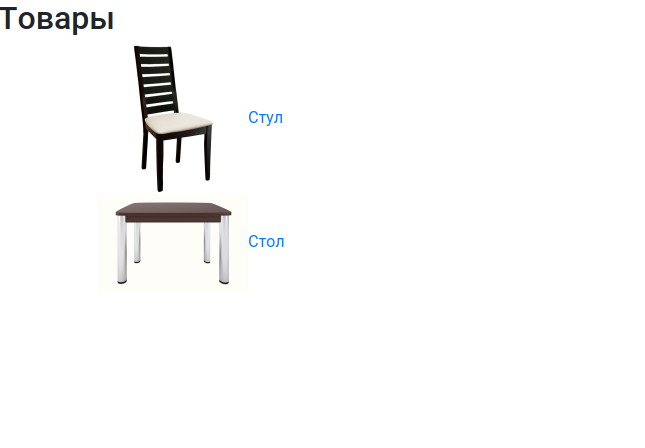
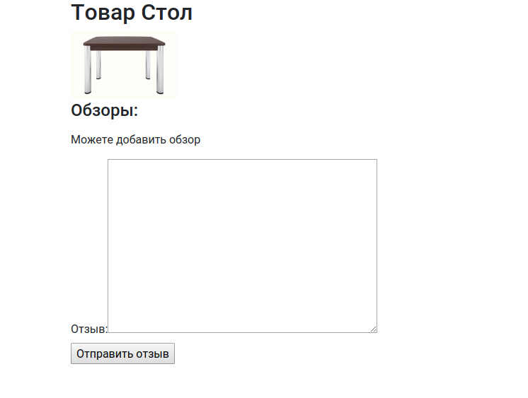

# Обзор товаров, добавление отзывов через формы django

Прототип сайта, с обратной связью от пользователя.

1) В `product_view` карточки товара реализован вывод всех оставленных отзывов на товар и окно ввода отзыва. Разделена GET и POST логика в функции.

2) Для ввода отзыва используется форму `ReviewForm`. Разрешается пользователю добавлять только один отзыв на товар.
Добавлена проверка (с использованием sessions), есть ли уже обзор этого товара от этого пользователя. В случае если отзыв оставить уже нельзя, не показыватется форму для отзыва. 

